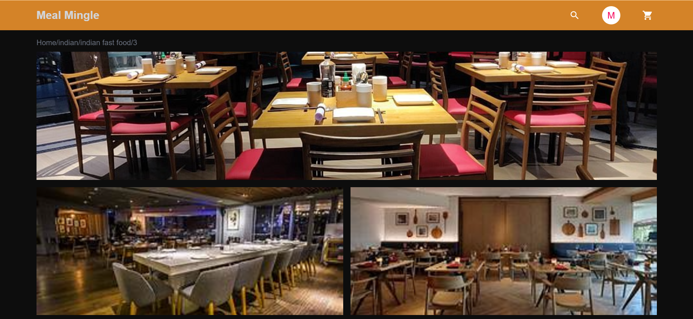
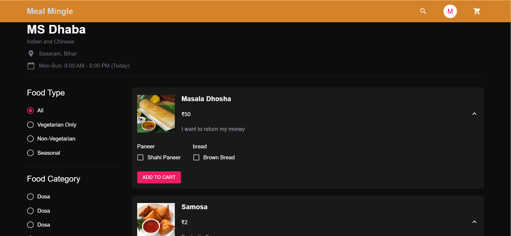
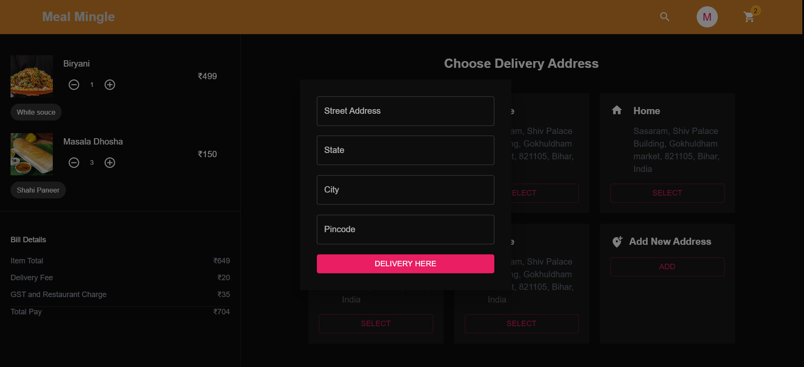
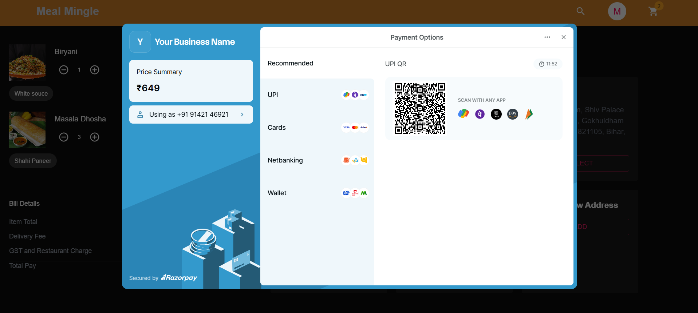

# Meal Mingle

Meal Mingle is a food ordering website that allows users to explore a variety of meals, add them to their cart, and proceed with payments. The website includes a seamless payment gateway for processing payments securely.

 


## Deployed Link
[Link Text](https://mealminglefood.vercel.app/)

## Features

- **User-Friendly Interface**: Browse through a variety of food items and easily add them to the cart.
- **Secure Payment Gateway**: Integrated payment system for easy checkout and secure payments.
- **Responsive Design**: Optimized for desktop and mobile devices.
- **User Authentication**: Allows users to log in and register for a personalized experience.
- **Cart Functionality**: Add, remove, and view items in your cart.
- **Order History**: Track your previous orders.

## Tech Stack

- **Frontend**:
  - React
  - Material UI
  - JavaScript/ES6
  - CSS3/SCSS

- **Backend**:
  - Spring Boot
  - Spring Security
  - MySQL (for storing user data, orders, etc.)

- **Payment Integration**:
  - Stripe API or any other payment gateway

## Setup

### Prerequisites

Make sure you have the following installed:

- Node.js and npm
- MySQL Workbench
- Stripe (or any other payment gateway account)

### Getting Started

1. Clone the repository:
   ```bash
   git clone https://github.com/yourusername/meal-mingle.git
   cd meal-mingle

2. Install dependencies:
npm install

3. Set up environment variables (you can create a .env file):
MYSQL_URI=your_mysql_database_uri
STRIPE_API_KEY=your_stripe_api_key
PORT=your_preferred_port

4. Start the development server:
npm start

5. Open your browser and go to http://localhost:3000 to see the application running.


Screenshots
Admin Page
 

Product Page
 

Restaurant
 

Cart Page
 
 

Payment Page
 


Contributing
We welcome contributions! If you would like to contribute, please fork the repository and create a pull request.